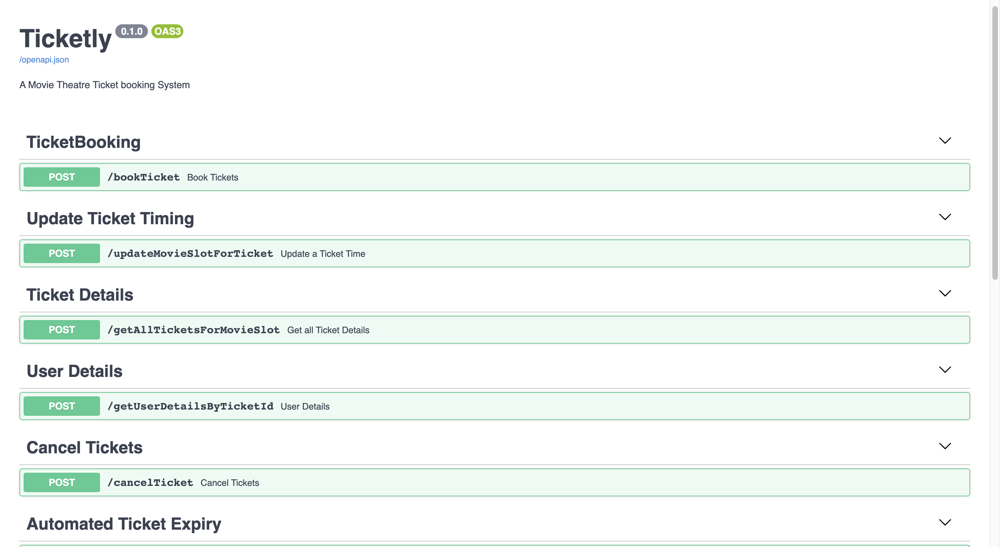
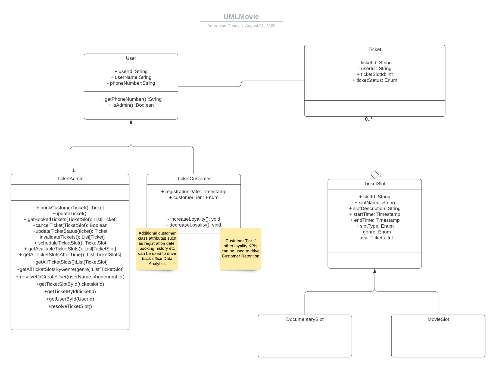
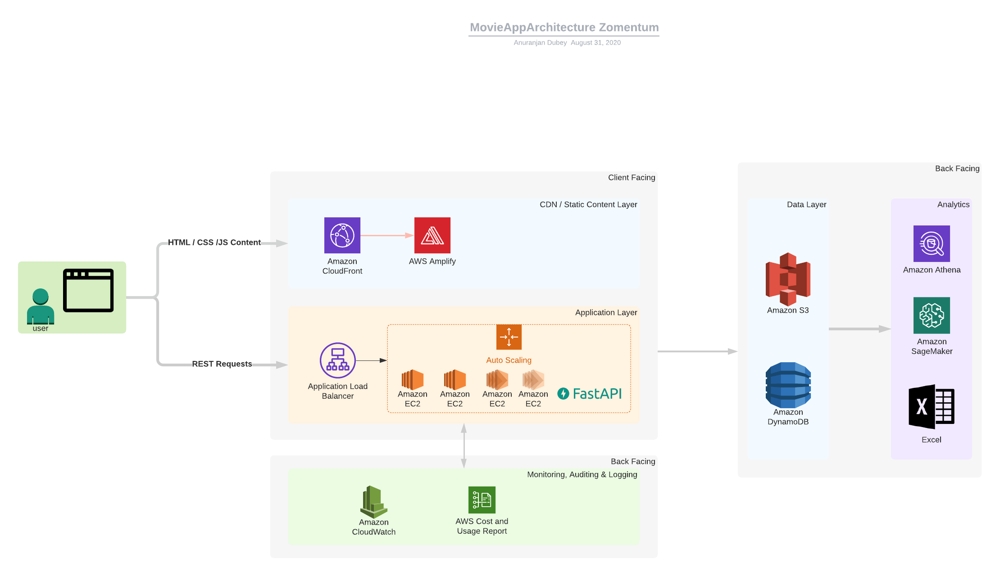
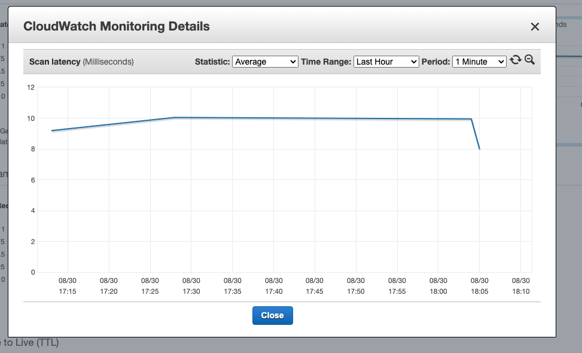
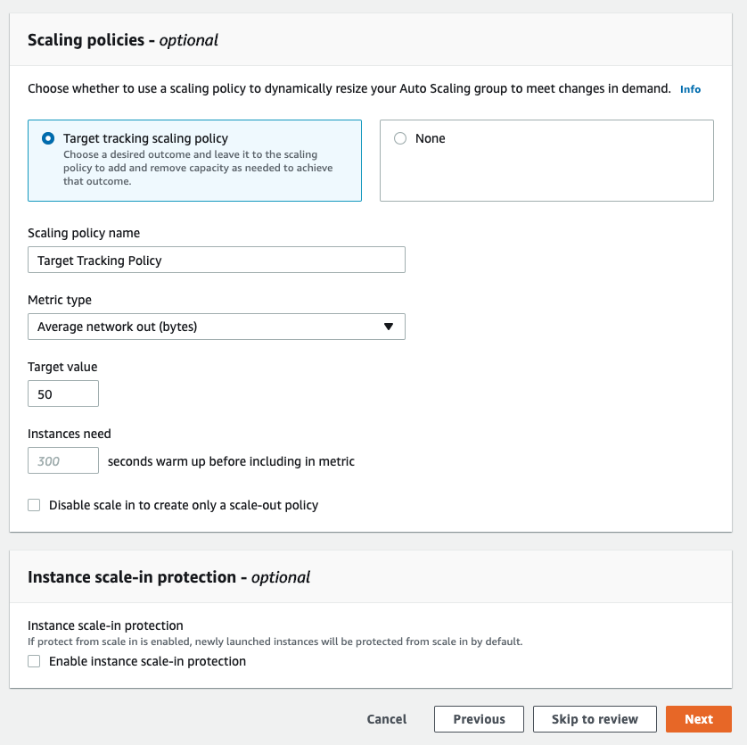

# Ticketly

A Movie Theatre Ticket Booking System Build in Python Using FastAPI.

## Swagger Page
### See It In Action

LoadBalancerURL: http://ticketlymain-1835126091.ap-south-1.elb.amazonaws.com:8477/docs#/

QR Code(Tryit on Your Phone): 



## Object Model

1. **TicketSlot** : A logical entity which defines movieslot (could be extended to documentaries, concerts etc - Hence the name `TicketSlot` and not just `MovieSlot`). It is defined as following:
```json
   {
        "slotName": "Skyfall", 
        "slotDescription": "An ex-MI6 agent steals a hard drive with top secret information to carry out a vendetta on Bond's overseer, M. Bond must face his past in a bid to try and save M.", 
        "startTime": "2020-11-01 12:22",
        "endTime": "2020-11-01 15:22", 
        "slotType": "Movie", 
        "genre": "Action"
    }
```

**Same movie can have many diffrent `TicketSlot`s if the movie is scheduled at many different timings.**

2. **Ticket** : A logical entity which defines a ticket object at a point in time. Tickets are `Booked` at the time of booking and the state changes to `Expired`, `Canceled`, `Archived` according to `Ticket`s lifecycle which is controled by the `TicketController`.

```json
    {
      "ticketStatus": "Booked",
      "ticketSlotId": "713396",
      "ticketId": "TKT331086",
      "userId": "U385985"
    }
```

3. **User** : A logical entity which defines a user object. Example:

```json
    {
        "userId": "U385985",
        "userName": "Anuranjan",
        "phoneNumber": "7906543416"
    }
```


## Sample Requests
<details><summary>CLICK ME</summary>

### Book User Ticket

```json
    {
        "userName": "John", 
        "userPhoneNumber": "9653864514", 
        "movieName": "Avatar",
        "movieStartTime":"2020-11-01 12:22",
        "numTickets": "3" 
    }
```

### Update Ticket Time

```json
    {
        "ticketId": "TKT437664", 
        "newMovie": "Avatar", 
        "newStartTime": "2020-11-01 12:22"
    }
```

### Get all Booked Tickets for a Movie Slot

```json
    {
        "movieName": "Inception", 
        "movieStartTime": "2020-11-01 12:22"
    }
```

### Get User Details By ticketId

```json
    {
        "ticketId": "TKT437664"
    }
```

### Cancel a Ticket By ticketId

```json
    {
        "ticketId": "TKT437664"
    }
```

### Add Movie Slot

```json
    {
        "slotName": "Skyfall", 
        "slotDescription": "An ex-MI6 agent steals a hard drive with top secret information to carry out a vendetta on Bond's overseer, M. Bond must face his past in a bid to try and save M.", 
        "startTime": "2020-11-01 12:22",
        "endTime": "2020-11-01 15:22", 
        "slotType": "Movie", 
        "genre": "Action"
    }
```

### Get All Movie Slots By Genre

```json
    {
        "genre": "Action"
    }
```
</details>

## Fine-grained API Access


# Features
- [x] Atomicity of Transactions (Transaction as a whole is rolled back if something goes wrong)
- [x] Immutability - Tickets cannot be recycled, a new ticket is generated at updation which saves a lot of trouble.
- [x] Cloud Enabled & Horizontally Scalable Service Oriented Architecture (AWS Support)
- [x] Object Oriented Design
- [x] Fast: Very high performance, on par with NodeJS and Go (thanks to FastAPI)
- [x] Automated Ticket Invalidation via `cron` - The cron jobs setup to run on ec2 automatically triggers `expireTickets` API to invalidate tickets after 8 hours


# Application Architecture
## UML Diagram
Since this seems like a system which might need code volution, new features to be added in future, I decided to closely follow the **OOPS paradigm**. UML also makes it easy to think through and handle corner cases.


The architecture of the application involves back-facing and a client-facing parts. I decided to use AWS for the backend of the application. The application is configured to use ec2, however, the instances are throttled and managed according to the scaling policies defined using **AWS AutoScaling Groups**. This is all configured behind an **Application Load Balancer (ALB)** which hides all the complexity from the user. 

When the ALB receives a request, it is automatically routed to one of the ec2 instances within the target group.


## Data Layer
For static content, we could leverage AWS Amplify and S3. For tables in particular, I decided to use **DynamoDB** for two reasons:
1. NoSQL Databases allow a code-first strategy. This allows easy integration with *ORM*s and thus, faster development. The schema is loosely coupled with code, and thus can evolve over time.
2. Faster read through.

### Fractional Millisecond Latency on SCAN operations
As shown below, even witha  simulated load test, the DynamoDB database can handle sub-millisecond latency for scans. (Note that this does not include GET operations where *hash_key* is involved, which are `O(logn)`)


## Scaling The Application
I chose to define a two-fold scaling mechanism. New nodes (ec2-instances) are spawned automatically if:
1. The ALB health-check (runs every 300 sec) marks the node unhealthy (disk failure / disaster etc)
2. The network load as observed by the nodes is higher than specified threadshold.

This could also be configured using **CloudWatch** logs. But because of limited time, I didn't get a chance to do it


### Node Status on AWS Dashboard


### Alarms Set For DDoS & Database Protection
AWS allows SNS alarms (Simple Notification Service) to be set up if there is an unusually high amount of load on the database


# The Nitty-Gritty

## Test Framework
**pytest** is used as the testing framework:


## Framework Used
Build with
- FastAPI
- Pydantic 

# How to Use


```python
    git clone https://github.com/almique/Movie_Ticket_Booking.git
    uvicorn main:app --reload
```

# Tests

Just install pytest and in the terminal type:

```python
    pytest
```


